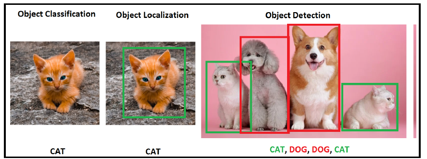
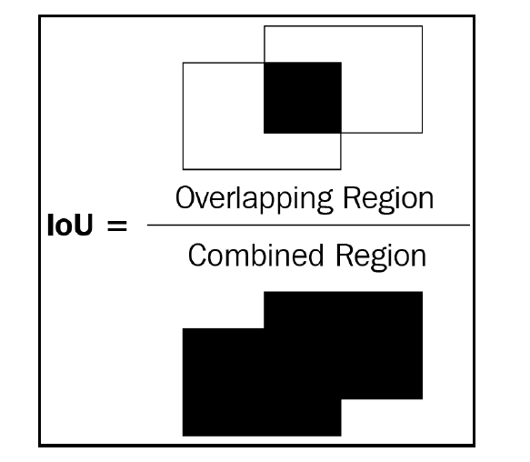

# Object Detection

By this image the Object classification, localization, detection can be clearly understood.

## Creating Data (object detection)

LabelImg Library - https://github.com/tzutalin/labelImg

## Metrics for Object Detection

### IOU (Intersection of Union)

Intersection within the term Intersection over Union measures how overlapping the
predicted and actual bounding boxes are, while Union measures the overall space
possible for overlap. IoU is the ratio of the overlapping region between the two
bounding boxes over the combined region of both the bounding boxes.

### Non Max Supression

Non-max refers to the boxes that do not contain the highest probability of containing
an object, and suppression refers to us discarding those boxes that do not contain the
highest probabilities of containing an object. In non-max suppression, we identify the
bounding box that has the highest probability and discard all the other bounding
boxes that have an IoU greater than a certain threshold with the box containing the
highest probability of containing an object.

### Mean average precision

Is the average of precision values calculated at various IoU
threshold values across all the classes of objects present within the dataset.
