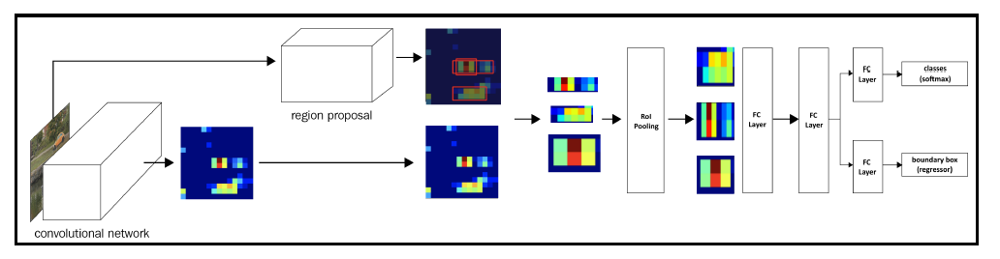

# Fast RCNN

## The Architecture

## The Steps Involved in Implementation

1. Pass the image through a pretrained model to extract features prior to the
flattening layer; let's call the output as feature maps.
2. Extract region proposals corresponding to the image.
3. Extract the feature map area corresponding to the region proposals (note
that when an image is passed through a VGG16 architecture, the image is
downscaled by 32 at the output as there are 5 pooling operations
performed. Thus, if a region exists with a bounding box of (40,32,200,240)
in the original image, the feature map corresponding to the bounding box
of (5,4,25,30) would correspond to the exact same region).
4. Pass the feature maps corresponding to region proposals through the RoI
(Region of Interest) pooling layer one at a time so that all feature maps of
region proposals have a similar shape. This is a replacement for the
warping that was executed in the R-CNN technique.
5. Pass the RoI pooling layer output value through a fully connected layer.
6. Train the model to predict the class and offsets corresponding to each
region proposal.

### Note

Note that the big difference between R-CNN and Fast R-CNN is
that, in R-CNN, we are passing the crops (resized region proposals)
through the pretrained model one at a time, while in Fast R-CNN,
we are cropping the feature map (which is obtained by passing the
whole image through a pretrained model) corresponding to each
region proposal and thereby avoiding the need to pass each resized
region proposal through the pretrained model.
