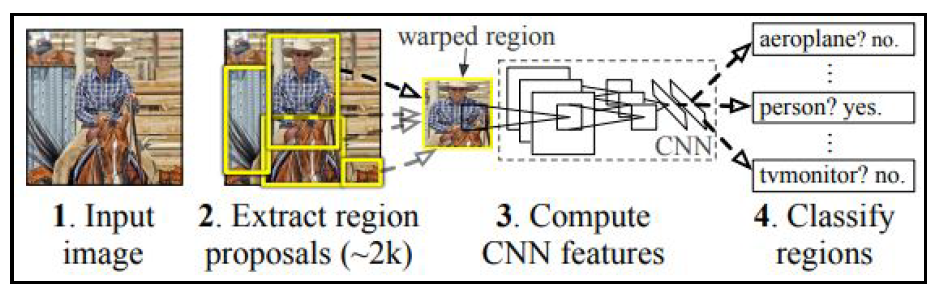

# RCNN

## Steps Involving in RCNN

1. Extract region proposals from an image:
Ensure that we extract a high number of proposals to not miss out on
any potential object within the image.
2. Resize (warp) all the extracted regions to get images of the same size.
3. Pass the resized region proposals through a network:
    - Typically, we pass the resized region proposals through a pretrained model such as VGG16 or ResNet50 and extract the features in a fully connected layer.
4. Create data for model training, where the input is features extracted by passing the region proposals through a pretrained model, and the outputs are the class corresponding to each region proposal and the offset of the region proposal from the ground truth corresponding to the image:
    - If a region proposal has an IoU greater than a certain threshold with the object, we prepare training data in such a way that the region is responsible for predicting the class of object it is overlapping with and also the offset of region proposal with the ground truth bounding box that contains the object of interest.
5. Connect two output heads, one corresponding to the class of image and the other corresponding to the offset of region proposal with the ground truth bounding box to extract the fine bounding box on the object:
    - This exercise would be similar to the use case where we predicted gender (categorical variable, analogous to the class of object in this case study) and age (continuous variable, analogous to the offsets to be done on top of region proposals) based on the image of the face of a person in the previous chapter.
6. Train the model post, writing a custom loss function that minimizes both
object classification error and the bounding box offset error.

### Implemetation

https://github.com/PacktPublishing/Modern-Computer-Vision-with-PyTorch/blob/master/Chapter07/Training_RCNN.ipynb
